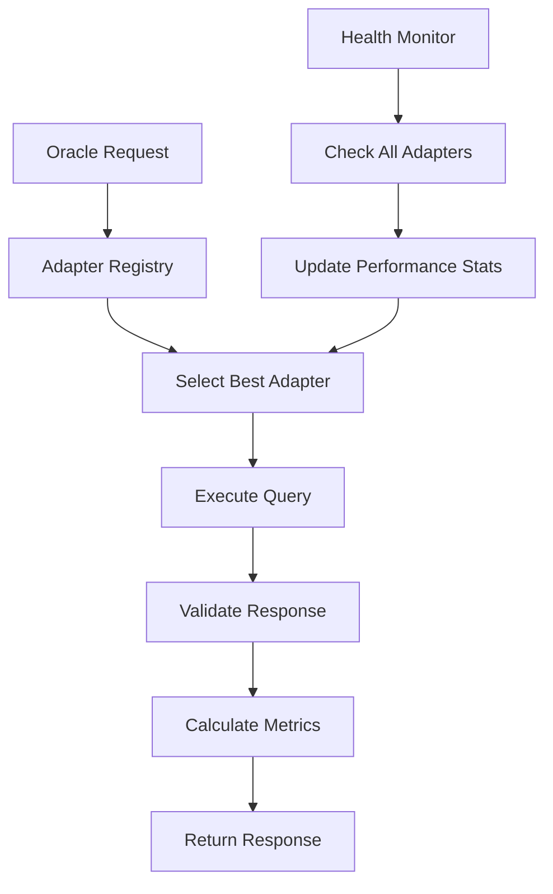

# Oracle Adapters Guide 🔌

**Building extensible oracle adapters for the OpenOracle ecosystem**

This guide shows how to create custom oracle adapters for any data source, making it easy to expand the OpenOracle network with new providers.

---

## 📋 Table of Contents

- [🎯 Overview](#-overview)
- [🏗️ Architecture](#️-architecture)
- [🐍 Python Adapters](#-python-adapters)
- [🟢 Node.js Adapters](#-nodejs-adapters)
- [⚛️ React Adapters](#️-react-adapters)
- [⛓️ Smart Contract Adapters](#️-smart-contract-adapters)
- [📚 Examples](#-examples)
- [🚀 Publishing](#-publishing)
- [🤝 Contributing](#-contributing)

---

## 🎯 Overview

OpenOracle uses a **plugin-based adapter system** that allows anyone to integrate new oracle providers with minimal code. Each adapter follows a standard interface across all platforms (Python, Node.js, React, Solidity).

### 🌟 Key Benefits

- **🔌 Plug & Play**: Add new oracle providers in minutes
- **🔄 Standardized**: Same interface across all languages
- **⚡ Performance**: Built-in caching and optimization
- **🛡️ Reliable**: Automatic failover and error handling
- **💰 Cost-Optimized**: Intelligent routing to cheapest providers
- **📊 Monitored**: Built-in metrics and health checking

### 🎯 Supported Oracle Types

| Data Type | Description | Examples |
|-----------|-------------|----------|
| **PRICE** | Financial market prices | BTC/USD, ETH/EUR, TSLA stock |
| **WEATHER** | Weather and climate data | Temperature, precipitation, air quality |
| **SPORTS** | Sports events and outcomes | Game scores, player stats, betting odds |
| **NEWS** | News and media analysis | Sentiment analysis, trending topics |
| **SOCIAL** | Social media data | Twitter sentiment, Reddit discussions |
| **CUSTOM** | Your own data sources | APIs, databases, IoT sensors |

---

## 🏗️ Architecture

### 🔄 Adapter Lifecycle



### 📊 Selection Criteria

Adapters are selected based on:

1. **📈 Success Rate**: Historical reliability
2. **⚡ Response Time**: Average query latency  
3. **💰 Cost**: Fee per query
4. **🎯 Data Type Support**: Compatibility with request
5. **🔄 Health Status**: Current availability
6. **👤 User Preferences**: Preferred providers

---

## 🐍 Python Adapters

### 🚀 Quick Start

```python
from openoracle.adapters import BaseOracleAdapter, DataType, OracleRequest

class MyOracleAdapter(BaseOracleAdapter):
    def _get_adapter_name(self) -> str:
        return "my-oracle"
    
    def _get_adapter_version(self) -> str:
        return "1.0.0"
    
    def _get_supported_data_types(self) -> List[DataType]:
        return [DataType.PRICE, DataType.CUSTOM]
    
    async def _execute_query(self, request: OracleRequest) -> Any:
        # Your oracle logic here
        if request.data_type == DataType.PRICE:
            return await self.get_price(request.query)
        # Add more data types...
    
    async def get_price(self, pair: str) -> Dict[str, Any]:
        # Implement your price fetching logic
        async with aiohttp.ClientSession() as session:
            async with session.get(f"https://api.yourapi.com/price/{pair}") as resp:
                data = await resp.json()
                return {
                    'price': float(data['price']),
                    'pair': pair,
                    'timestamp': data['timestamp']
                }

# Register your adapter
from openoracle.adapters import oracle_registry

adapter = MyOracleAdapter({
    'api_key': 'your-api-key',
    'base_url': 'https://api.yourapi.com'
})

oracle_registry.register_adapter(adapter)
```

### 📚 Complete Example: CoinGecko Adapter

```python
"""
CoinGecko Oracle Adapter - Real implementation example
"""
import aiohttp
from typing import Dict, List, Any
from openoracle.adapters import BaseOracleAdapter, OracleRequest, DataType

class CoinGeckoAdapter(BaseOracleAdapter):
    """
    CoinGecko oracle adapter for cryptocurrency prices.
    
    Free tier: 10-50 calls/minute
    Pro tier: Higher rate limits with API key
    
    Usage:
        adapter = CoinGeckoAdapter({
            'api_key': 'your-coingecko-pro-key',  # Optional
            'rate_limit': 30  # Calls per minute
        })
    """
    
    def _get_adapter_name(self) -> str:
        return "coingecko"
    
    def _get_adapter_version(self) -> str:
        return "1.0.0"
    
    def _get_supported_data_types(self) -> List[DataType]:
        return [DataType.PRICE]
    
    async def _execute_query(self, request: OracleRequest) -> Any:
        if request.data_type == DataType.PRICE:
            return await self._get_cryptocurrency_price(request.query)
        else:
            raise ValueError(f"Unsupported data type: {request.data_type}")
    
    async def _get_cryptocurrency_price(self, pair: str) -> Dict[str, Any]:
        """Get cryptocurrency price from CoinGecko API"""
        
        # Parse trading pair (e.g., "BTC/USD" -> "bitcoin", "usd")
        base, quote = self._parse_trading_pair(pair)
        
        base_url = "https://api.coingecko.com/api/v3"
        if self.config.get('api_key'):
            base_url = "https://pro-api.coingecko.com/api/v3"
        
        headers = {}
        if self.config.get('api_key'):
            headers['x-cg-pro-api-key'] = self.config['api_key']
        
        async with aiohttp.ClientSession() as session:
            url = f"{base_url}/simple/price"
            params = {
                'ids': base,
                'vs_currencies': quote,
                'include_24hr_change': 'true',
                'include_last_updated_at': 'true'
            }
            
            async with session.get(url, headers=headers, params=params) as response:
                response.raise_for_status()
                data = await response.json()
                
                if base not in data:
                    raise ValueError(f"Price data not found for {pair}")
                
                price_data = data[base]
                price = price_data.get(quote.lower())
                
                if price is None:
                    raise ValueError(f"Price not available for {quote}")
                
                return {
                    'price': float(price),
                    'pair': pair,
                    'base_currency': base,
                    'quote_currency': quote,
                    'change_24h': price_data.get(f'{quote.lower()}_24h_change'),
                    'last_updated': price_data.get('last_updated_at'),
                    'source': 'coingecko'
                }
    
    def _parse_trading_pair(self, pair: str) -> tuple[str, str]:
        """Parse trading pair into base and quote currencies"""
        
        # Common cryptocurrency mappings
        crypto_map = {
            'BTC': 'bitcoin',
            'ETH': 'ethereum', 
            'ADA': 'cardano',
            'SOL': 'solana',
            'AVAX': 'avalanche-2',
            'LINK': 'chainlink',
            'DOT': 'polkadot',
            'MATIC': 'matic-network'
        }
        
        if '/' in pair:
            base_symbol, quote_symbol = pair.upper().split('/')
            base = crypto_map.get(base_symbol, base_symbol.lower())
            quote = quote_symbol.lower()
            return base, quote
        else:
            raise ValueError("Invalid pair format. Use 'BASE/QUOTE' format (e.g., 'BTC/USD')")
    
    def _calculate_confidence(self, data: Any, request: OracleRequest) -> float:
        """Calculate confidence based on data freshness"""
        if not data:
            return 0.0
        
        # Higher confidence for recent updates
        if 'last_updated' in data:
            age_seconds = time.time() - data['last_updated']
            if age_seconds < 300:    # Less than 5 minutes
                return 0.95
            elif age_seconds < 900:  # Less than 15 minutes
                return 0.85
            else:
                return 0.75
        
        return 0.8
    
    def _calculate_cost(self, request: OracleRequest) -> float:
        """CoinGecko is free for basic usage"""
        return 0.0  # Free tier
    
    async def _health_check_query(self) -> Any:
        """Health check using BTC/USD"""
        return await self._get_cryptocurrency_price("BTC/USD")

# Example usage
if __name__ == "__main__":
    import asyncio
    
    async def test_coingecko():
        adapter = CoinGeckoAdapter({})
        
        request = OracleRequest(
            query="BTC/USD",
            data_type=DataType.PRICE
        )
        
        response = await adapter.query(request)
        print(f"BTC Price: ${response.data['price']:,.2f}")
        print(f"Confidence: {response.confidence:.1%}")
        print(f"Latency: {response.latency_ms}ms")
    
    asyncio.run(test_coingecko())
```

---

## 🟢 Node.js Adapters

### 🚀 Quick Start

```typescript
import { BaseOracleAdapter, DataType, OracleRequest } from './BaseOracleAdapter'

export class MyOracleAdapter extends BaseOracleAdapter {
  protected getAdapterName(): string {
    return 'my-oracle'
  }
  
  protected getAdapterVersion(): string {
    return '1.0.0'
  }
  
  protected getSupportedDataTypes(): DataType[] {
    return [DataType.PRICE, DataType.CUSTOM]
  }
  
  protected async executeQuery(request: OracleRequest): Promise<any> {
    // Your oracle logic here
    if (request.dataType === DataType.PRICE) {
      return this.getPrice(request.query)
    }
    // Add more data types...
  }
  
  private async getPrice(pair: string): Promise<any> {
    // Implement your price fetching logic
    const response = await fetch(`https://api.yourapi.com/price/${pair}`)
    const data = await response.json()
    
    return {
      price: parseFloat(data.price),
      pair,
      timestamp: data.timestamp
    }
  }
}

// Register your adapter
import { oracleRegistry } from './BaseOracleAdapter'

const adapter = new MyOracleAdapter({
  apiKey: 'your-api-key',
  baseUrl: 'https://api.yourapi.com'
})

oracleRegistry.registerAdapter(adapter)
```

### 📚 Complete Example: Binance Adapter

```typescript
/**
 * Binance Oracle Adapter - Real implementation example
 */
import axios from 'axios'
import { BaseOracleAdapter, DataType, OracleRequest, AdapterConfig } from './BaseOracleAdapter'

export interface BinanceConfig extends AdapterConfig {
  apiKey?: string
  secretKey?: string
  testnet?: boolean
}

export class BinanceAdapter extends BaseOracleAdapter {
  
  constructor(config: BinanceConfig) {
    super(config)
  }

  protected getAdapterName(): string {
    return 'binance'
  }

  protected getAdapterVersion(): string {
    return '1.0.0'
  }

  protected getSupportedDataTypes(): DataType[] {
    return [DataType.PRICE]
  }

  protected async executeQuery(request: OracleRequest): Promise<any> {
    switch (request.dataType) {
      case DataType.PRICE:
        return this.getPrice(request.query)
      default:
        throw new Error(`Unsupported data type: ${request.dataType}`)
    }
  }

  /**
   * Get real-time price from Binance API
   */
  private async getPrice(pair: string): Promise<any> {
    const baseUrl = (this.config as BinanceConfig).testnet 
      ? 'https://testnet.binance.vision/api/v3'
      : 'https://api.binance.com/api/v3'
    
    // Convert pair format: "BTC/USD" -> "BTCUSDT"
    const symbol = this.formatBinanceSymbol(pair)
    
    try {
      const response = await axios.get(`${baseUrl}/ticker/price`, {
        params: { symbol }
      })
      
      return {
        price: parseFloat(response.data.price),
        pair,
        symbol,
        exchange: 'binance',
        timestamp: Date.now()
      }
      
    } catch (error) {
      if (axios.isAxiosError(error)) {
        throw new Error(`Binance API error: ${error.response?.status} ${error.response?.statusText}`)
      }
      throw error
    }
  }

  /**
   * Convert standard pair format to Binance symbol format
   */
  private formatBinanceSymbol(pair: string): string {
    const symbolMap: Record<string, string> = {
      'BTC/USD': 'BTCUSDT',
      'ETH/USD': 'ETHUSDT',
      'BNB/USD': 'BNBUSDT',
      'ADA/USD': 'ADAUSDT',
      'SOL/USD': 'SOLUSDT',
      'AVAX/USD': 'AVAXUSDT',
      'LINK/USD': 'LINKUSDT',
      'DOT/USD': 'DOTUSDT'
    }
    
    const binanceSymbol = symbolMap[pair.toUpperCase()]
    if (!binanceSymbol) {
      // Try generic conversion: "BTC/USD" -> "BTCUSD"
      return pair.replace('/', '').toUpperCase() + 'T'
    }
    
    return binanceSymbol
  }

  protected calculateConfidence(data: any): number {
    // Binance is generally very reliable for price data
    return data && data.price ? 0.95 : 0.0
  }

  protected calculateCost(): number {
    // Binance API is free for basic usage
    return 0.0
  }

  protected getResponseMetadata(): Record<string, any> {
    return {
      exchange: 'binance',
      network: (this.config as BinanceConfig).testnet ? 'testnet' : 'mainnet',
      rateLimit: '1200/minute'
    }
  }

  protected async healthCheckQuery(): Promise<any> {
    return this.getPrice('BTC/USD')
  }
}

// Usage example
export const createBinanceAdapter = (config: BinanceConfig = {}): BinanceAdapter => {
  return new BinanceAdapter({
    testnet: false,
    ...config
  })
}
```

---

## ⚛️ React Adapters

### 🚀 Quick Start

```tsx
import { BaseOracleAdapter } from 'openoracle-react-sdk'

export class MyReactOracleAdapter extends BaseOracleAdapter {
  name = 'my-oracle'
  version = '1.0.0'
  supportedDataTypes = ['price', 'custom']
  
  async query(request: OracleRequest): Promise<OracleResponse> {
    // Your oracle logic here
    const data = await fetch(`https://api.yourapi.com/query`, {
      method: 'POST',
      body: JSON.stringify(request)
    })
    
    return {
      data: await data.json(),
      provider: this.name,
      timestamp: Date.now(),
      confidence: 0.9
    }
  }
}

// Register with React context
import { OracleProvider } from 'openoracle-react-sdk'

function App() {
  return (
    <OracleProvider 
      adapters={[new MyReactOracleAdapter()]}
      fallbackAdapters={['chainlink', 'pyth']}
    >
      <YourApp />
    </OracleProvider>
  )
}
```

---

## ⛓️ Smart Contract Adapters

### 🚀 Quick Start

```solidity
// SPDX-License-Identifier: MIT
pragma solidity ^0.8.19;

import "./IOracleAdapter.sol";

contract MyOracleAdapter is IOracleAdapter {
    
    mapping(string => uint256) public priceData;
    
    function query(
        string memory queryString,
        uint8 dataType,
        bytes memory parameters
    ) external override returns (bytes memory data, uint256 confidence) {
        
        require(dataType == 0, "Only price data supported"); // PRICE = 0
        
        // Your oracle logic here
        uint256 price = getPrice(queryString);
        uint256 conf = calculateConfidence(price);
        
        data = abi.encode(price, block.timestamp, queryString);
        confidence = conf;
        
        return (data, confidence);
    }
    
    function getPrice(string memory pair) internal view returns (uint256) {
        // Implement your price logic
        return priceData[pair];
    }
    
    function updatePrice(string memory pair, uint256 price) external {
        // Update price data (add access controls as needed)
        priceData[pair] = price;
    }
}
```

### 📚 Complete Example: Pyth Network Adapter

```solidity
// SPDX-License-Identifier: MIT
pragma solidity ^0.8.19;

import "./IOracleAdapter.sol";
import "@pythnetwork/pyth-sdk-solidity/IPyth.sol";
import "@pythnetwork/pyth-sdk-solidity/PythStructs.sol";

/**
 * @title PythOracleAdapter
 * @dev Oracle adapter for integrating with Pyth Network price feeds
 */
contract PythOracleAdapter is IOracleAdapter {
    
    IPyth public pythContract;
    
    mapping(string => bytes32) public priceIds;
    mapping(bytes32 => string) public pairNames;
    
    uint256 public constant MAX_PRICE_AGE = 300; // 5 minutes
    
    event PriceIdAdded(string indexed pair, bytes32 priceId);
    
    constructor(address pythContractAddr) {
        pythContract = IPyth(pythContractAddr);
        
        // Initialize common price feeds
        addPriceFeed("BTC/USD", 0xe62df6c8b4a85fe1a67db44dc12de5db330f7ac66b72dc658afedf0f4a415b43);
        addPriceFeed("ETH/USD", 0xff61491a931112ddf1bd8147cd1b641375f79f5825126d665480874634fd0ace);
        addPriceFeed("SOL/USD", 0xef0d8b6fda2ceba41da15d4095d1da392a0d2f8ed0c6c7bc0f4cfac8c280b56d);
    }
    
    /**
     * @dev Execute oracle query (implements IOracleAdapter)
     */
    function query(
        string memory queryString,
        uint8 dataType,
        bytes memory parameters
    ) external override returns (bytes memory data, uint256 confidence) {
        require(dataType == 0, "Only price data supported"); // DataType.PRICE = 0
        
        bytes32 priceId = priceIds[queryString];
        require(priceId != bytes32(0), "Price feed not supported");
        
        // Get price from Pyth
        PythStructs.Price memory pythPrice = pythContract.getPriceUnsafe(priceId);
        
        // Calculate confidence based on price age and confidence interval
        confidence = calculatePythConfidence(pythPrice);
        require(confidence > 0, "Price data too old or unreliable");
        
        // Encode response
        data = abi.encode(
            uint256(int256(pythPrice.price)), // Convert int64 to uint256
            pythPrice.publishTime,
            uint256(int256(pythPrice.conf)),
            queryString
        );
        
        return (data, confidence);
    }
    
    /**
     * @dev Calculate confidence score from Pyth price data
     */
    function calculatePythConfidence(PythStructs.Price memory pythPrice) 
        internal 
        view 
        returns (uint256) 
    {
        // Check price age
        uint256 priceAge = block.timestamp - pythPrice.publishTime;
        if (priceAge > MAX_PRICE_AGE) {
            return 0; // Too old
        }
        
        // Check confidence interval
        uint256 price = uint256(int256(pythPrice.price));
        uint256 confidence_interval = uint256(int256(pythPrice.conf));
        
        if (price == 0) return 0;
        
        // Calculate confidence ratio
        uint256 confidenceRatio = (confidence_interval * 10000) / price; // Basis points
        
        if (confidenceRatio < 10) {        // Less than 0.1% uncertainty
            return 95;
        } else if (confidenceRatio < 50) { // Less than 0.5% uncertainty
            return 85;
        } else if (confidenceRatio < 100) {// Less than 1% uncertainty
            return 75;
        } else {
            return 60;
        }
    }
    
    // ============ Management Functions ============
    
    /**
     * @dev Add new price feed
     */
    function addPriceFeed(string memory pair, bytes32 priceId) public {
        require(bytes(pair).length > 0, "Invalid pair");
        require(priceId != bytes32(0), "Invalid price ID");
        
        priceIds[pair] = priceId;
        pairNames[priceId] = pair;
        
        emit PriceIdAdded(pair, priceId);
    }
    
    /**
     * @dev Remove price feed
     */
    function removePriceFeed(string memory pair) external {
        bytes32 priceId = priceIds[pair];
        require(priceId != bytes32(0), "Price feed not found");
        
        delete priceIds[pair];
        delete pairNames[priceId];
    }
    
    /**
     * @dev Check if pair is supported
     */
    function isPairSupported(string memory pair) external view returns (bool) {
        return priceIds[pair] != bytes32(0);
    }
}
```

---

## 📚 Examples

### 🌐 Real-World Integration Examples

#### 1. **Alpha Vantage Stock Adapter**

```python
class AlphaVantageAdapter(BaseOracleAdapter):
    """Stock market data from Alpha Vantage"""
    
    def _get_adapter_name(self) -> str:
        return "alpha-vantage"
    
    def _get_supported_data_types(self) -> List[DataType]:
        return [DataType.PRICE]  # Stock prices
    
    async def _execute_query(self, request: OracleRequest) -> Any:
        symbol = request.query  # e.g., "AAPL", "TSLA"
        
        url = "https://www.alphavantage.co/query"
        params = {
            'function': 'GLOBAL_QUOTE',
            'symbol': symbol,
            'apikey': self.config['api_key']
        }
        
        async with aiohttp.ClientSession() as session:
            async with session.get(url, params=params) as response:
                data = await response.json()
                quote = data["Global Quote"]
                
                return {
                    'symbol': symbol,
                    'price': float(quote['05. price']),
                    'change': float(quote['09. change']),
                    'change_percent': quote['10. change percent'],
                    'volume': int(quote['06. volume']),
                    'source': 'alpha-vantage'
                }
```

#### 2. **Weather API Adapter**

```typescript
export class OpenWeatherAdapter extends BaseOracleAdapter {
  
  protected getAdapterName(): string {
    return 'openweather'
  }
  
  protected getSupportedDataTypes(): DataType[] {
    return [DataType.WEATHER]
  }
  
  protected async executeQuery(request: OracleRequest): Promise<any> {
    const location = request.query // e.g., "New York,US"
    
    const response = await axios.get('https://api.openweathermap.org/data/2.5/weather', {
      params: {
        q: location,
        appid: this.config.apiKey,
        units: 'metric'
      }
    })
    
    return {
      location,
      temperature: response.data.main.temp,
      humidity: response.data.main.humidity,
      description: response.data.weather[0].description,
      windSpeed: response.data.wind.speed,
      pressure: response.data.main.pressure,
      source: 'openweather'
    }
  }
}
```

#### 3. **Custom Database Adapter**

```python
class DatabaseAdapter(BaseOracleAdapter):
    """Query your own database as an oracle"""
    
    def _get_adapter_name(self) -> str:
        return "custom-database"
    
    def _get_supported_data_types(self) -> List[DataType]:
        return [DataType.CUSTOM]
    
    async def _execute_query(self, request: OracleRequest) -> Any:
        # Connect to your database
        import asyncpg
        
        conn = await asyncpg.connect(self.config['database_url'])
        
        try:
            # Execute query safely with parameterized statements
            if request.query == "user_count":
                result = await conn.fetchval("SELECT COUNT(*) FROM users")
                return {'user_count': result}
                
            elif request.query == "total_volume":
                result = await conn.fetchval("SELECT SUM(amount) FROM transactions")
                return {'total_volume': float(result)}
                
            else:
                raise ValueError(f"Unsupported query: {request.query}")
                
        finally:
            await conn.close()
```

### 🎮 Gaming Oracle Examples

```typescript
// Fortnite Stats Oracle
export class FortniteStatsAdapter extends BaseOracleAdapter {
  protected async executeQuery(request: OracleRequest): Promise<any> {
    const playerId = request.query
    
    const response = await axios.get(`https://fortniteapi.io/v1/stats`, {
      headers: { 'Authorization': this.config.apiKey },
      params: { account: playerId }
    })
    
    return {
      player: playerId,
      kills: response.data.global_stats.solo.kills,
      wins: response.data.global_stats.solo.wins,
      kd_ratio: response.data.global_stats.solo.kd,
      source: 'fortnite-api'
    }
  }
}

// Chess.com Rating Oracle  
export class ChessRatingAdapter extends BaseOracleAdapter {
  protected async executeQuery(request: OracleRequest): Promise<any> {
    const username = request.query
    
    const response = await axios.get(`https://api.chess.com/pub/player/${username}/stats`)
    
    return {
      username,
      blitz_rating: response.data.chess_blitz?.last?.rating,
      bullet_rating: response.data.chess_bullet?.last?.rating,
      rapid_rating: response.data.chess_rapid?.last?.rating,
      source: 'chess.com'
    }
  }
}
```

---

## 🚀 Publishing

### 📦 Publish Your Adapter

Once you've created an adapter, you can publish it for the community:

#### 1. **Create Adapter Package**

```bash
# Create new adapter package
mkdir my-oracle-adapter
cd my-oracle-adapter

# Python adapter
cat > setup.py << EOF
from setuptools import setup, find_packages

setup(
    name="openoracle-my-oracle",
    version="1.0.0",
    packages=find_packages(),
    install_requires=["openoracle>=0.1.0"],
    author="Your Name",
    description="My Oracle adapter for OpenOracle Protocol"
)
EOF

# Node.js adapter
cat > package.json << EOF
{
  "name": "openoracle-my-oracle",
  "version": "1.0.0", 
  "main": "dist/index.js",
  "peerDependencies": {
    "openoracle-sdk-js": ">=1.0.0"
  }
}
EOF
```

#### 2. **Test Your Adapter**

```python
# Python testing
import pytest
from openoracle.adapters import oracle_registry
from my_oracle_adapter import MyOracleAdapter

def test_my_adapter():
    adapter = MyOracleAdapter({'api_key': 'test'})
    oracle_registry.register_adapter(adapter)
    
    request = OracleRequest(query="test", data_type=DataType.PRICE)
    response = await adapter.query(request)
    
    assert response.confidence > 0
    assert response.data is not None
```

#### 3. **Publish to Registry**

```bash
# Python
pip install build twine
python -m build
twine upload dist/*

# Node.js  
npm publish

# Submit to OpenOracle Adapter Registry
curl -X POST https://api.openoracle.ai/v1/adapters \
  -H "Content-Type: application/json" \
  -d '{
    "name": "my-oracle",
    "language": "python",
    "package": "openoracle-my-oracle", 
    "description": "My awesome oracle adapter",
    "supported_data_types": ["price", "custom"]
  }'
```

### 🏆 Featured Adapters

**Community-created adapters:**

| Adapter | Data Type | Language | Author | Package |
|---------|-----------|----------|--------|---------|
| **CoinMarketCap** | Price | Python | @cryptodev | `openoracle-cmc` |
| **ESPN Sports** | Sports | Node.js | @sportsdata | `openoracle-espn` |
| **Twitter API** | Social | React | @socialmedia | `openoracle-twitter` |
| **Weather.gov** | Weather | All | @weatherfan | `openoracle-weather` |

---

## 🤝 Contributing

### 🎯 How to Contribute Adapters

1. **💡 Propose**: Open GitHub issue with adapter idea
2. **🔧 Build**: Implement using our base classes
3. **🧪 Test**: Add comprehensive tests
4. **📚 Document**: Write usage examples
5. **🚀 Submit**: Create pull request
6. **🎉 Celebrate**: Get featured in the community!

### 🏆 Adapter Guidelines

**✅ Good Adapter Practices:**
- Clear, descriptive adapter names
- Comprehensive error handling
- Proper confidence scoring
- Health check implementation
- Good documentation with examples
- Respect API rate limits
- Secure credential handling

**❌ Avoid These Mistakes:**
- Hardcoded credentials
- No error handling
- Missing health checks
- Poor documentation
- Rate limit violations
- Inconsistent response formats

### 🎁 Contributor Rewards

**Oracle Adapter Contributors Get:**
- 🎖️ **Recognition** in our hall of fame
- 🪙 **Token Rewards** when $ORACLE launches
- 📢 **Social Media** shoutouts
- 🚀 **Early Access** to new features
- 💰 **Revenue Sharing** from adapter usage (future)

---

## 📞 Support

### 🆘 Need Help?

- **💬 Discord**: [#adapter-development](https://discord.gg/openoracle)
- **📧 Email**: adapters@openoracle.ai
- **🐛 GitHub**: [Create an issue](https://github.com/samthedataman/openoracle-protocol/issues)
- **📚 Docs**: [Full API Reference](https://docs.openoracle.ai/adapters)

### 🤝 Let's Build Together!

The OpenOracle ecosystem grows stronger with every new adapter. Whether you're integrating a major API or a niche data source, your contribution helps create the most comprehensive oracle network in DeFi.

**Ready to build your oracle adapter? Let's go! 🚀**

---

<div align="center">

**🔮 Building the Future of Oracle Infrastructure**

[Adapter Template](./templates/) • [API Docs](https://docs.openoracle.ai) • [Community](https://discord.gg/openoracle)

</div>